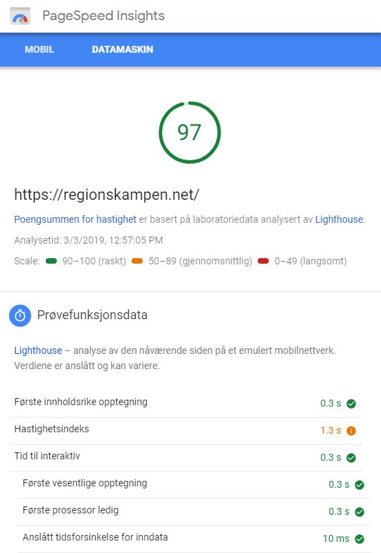

# Regionskampen

En statisk nettside laget med [Gatsby](https://www.gatsbyjs.org) og React. Denne siden kan installeres som en progressiv webapp ved hjelp av en plugin fra Gatsby. 

CSS via [Styled Components](https://www.styled-components.com/).

### Hva er regionskampen?

Regionskampen er en årlig fotballkamp som spilles mellom Ridabu og Ingeberg - to distrikter i Hamar kommune. Første kamp ble spilt i 2003 og vi har spilt mot hverandre hvert år siden.

### PageSpeed Insights

