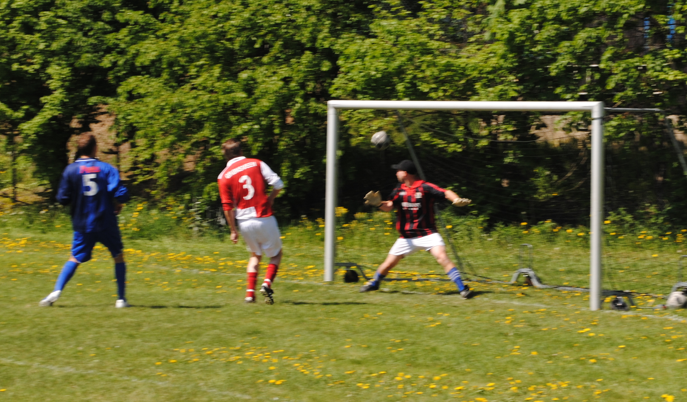
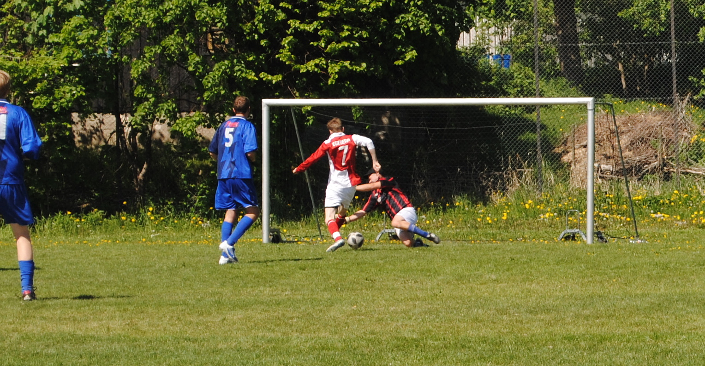
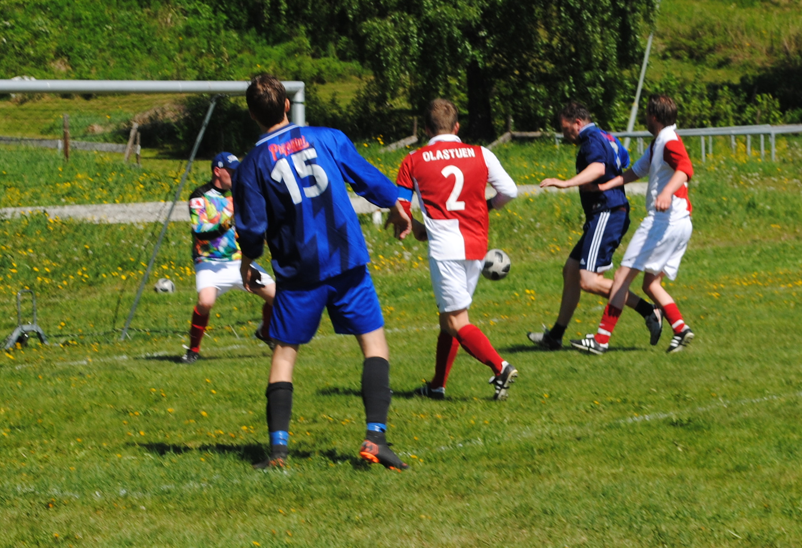

**Det var før årets kamp knyttet stor spenning til hvordan «Nye» Azurri skulle fremstå. Ridabus primus motor og taktiske overhode gjennom de 15 siste kampene, Ole Johnny Sundt, hadde valgt å legge både sko og taktikkblokk på hylla, og nye krefter og ideer ble tvunget frem i lyset. Uten noen erklært «coach» og lederstemme, var det en munter gjeng som entret banen til rekordtidlig avspark denne mai-formiddagen. Men om stemningen utad var aldri så god, var det mangelen på plan og samhandling innad som gav det varige inntrykket.**

*Av Mikal Larsen*

Ingeberg, med mange tunge forfall og en tynn tropp, hadde på forhånd bestemt seg for å legge seg lavt og la Ridabu styre spillet innledningsvis. Med klar rød dominans i sammendraget siden 2014, hvilte det denne gangen et klart favorittstempel på de blå. Ridabu fikk kjenne mye på kula de første minuttene, men et avventende Ingeberg ble ikke satt på altfor store prøvelser. Vikar-keeper Mikalsen måtte plukke et par halvhjertede langskudd, men verken svetteperler eller puls over de komfortable ble framprovosert de første ti minuttene. 

Etter en passiv start med rollene tydelig fordelt lagene imellom, begynte spillerne i rødt gradvis å bli mer komfortable på det ujevne underlaget. Ingeberg våget etter hvert å ta mer tak i ballen og fikk flyttet opp spillet i større grad. Flere gode initiativ, spesielt langs venstrekanten og et klart taktskifte med tanke på balltempoet sentralt skulle ganske raskt gi resultat for de røde. Etter en tålmodig oppbygging bakfra, der ballen til slutt havnet hos Magne Søby som hadde flyttet seg høyt oppe i banen, et rapt innlegg/skudd fra samme mann og et langt Grønsveen-kne, var stillingen plutselig 0-1. Marginalt mot spillets gang, men med scoring på kampens første sjanse så var det ingen skrell sånn sett. 

Scoringen førte ikke til den ventede blå reaksjonen, men gav isteden mer bensin på det allerede ulmende Ingeberg-bålet. Målscorer Grønsveen var i spillehumør og de gode involveringene kom på løpende bånd. På venstresiden hadde Even Egeberg og Magne Søby virkelig funnet tonen, og Ridabu hadde sitt svare strev med å forsvare seg.

Etter om lag tjue spilte minutter skulle nok en gang omgangens «lirare» skinne. Grønsveen mottok et kort oppspill sentralt i banen. Med Espen Arnesen i ryggen var det nok ikke mange som trodde han skulle stå på beina 0,3 sek senere, langt mindre med ballen i beina. Vendingen var av det utsøkte slaget, Arnesen i pølsekø på Haugs. Med en perfekt vektet pasning med utsiden av venstrefoten, var Egeberg alene gjennom: 0-2!  

Før andre omgang ble det gjort et noe uventet Ridabu-grep: Keeper Monsen, som tråkker over bare han ser grønt gress, ble utespiller, mens Gjerlaug tok plass mellom stengene. Ridabu hadde plutselig et meget usikkert og uforutsigbart kort ute på høyre kant, men like fullt en vrien utfordring for halvtrøtte Ingeberg-bein. Trekket hadde umiddelbar effekt, og Ingeberg hadde mer enn nok med å holde unna i åpningsminuttene. 

Om ballinnehavet igjen ble dominert av de blå, var det langt mellom scoringsmulighetene. Flere gode initiativ kokte bort i dårlige valg og Ingebergs keeper fikk flere anledninger til å bruke tid oppe i buskaset på leting etter baller. En humpete bane må nok ta noe av skylda, men at Ridabu savnet avslutningsegenskapene som et par Ingeberg-spillere innehar, var det liten tvil om.
Til slutt var det imidlertid uunngåelig med blå uttelling. David Arnesen fikk fritt spillerom sentralt og satte fart mot et ryggende Ingeberg-forsvar. Støtet ble satt inn akkurat tidsnok til å hindre skudd, men taklinga endte til slutt opp foran en fortumlet E.Arnesen, som fikk en enkel jobb med å tuppe ballen forbi Ingebergs målvakt. Med drøye fem minutter igjen på klokka, var det på ny spenning i lufta.

Nervøse og slitne Ingeberg-bein fikk sin fulle hyre med å banke unna de siste minuttene, men de store mulighetene for utligning kom aldri. Faktisk var man i sluttminuttene nærmere 1-3 på overgang enn 2-2 og da dommer S.Egeberg blåse i fløyta, kunne de røde for fjerde gang på fem år strekke hendene i været. Med det resultatet er stillingen nå 8-8 i sammendraget med en kamp som har endt uavgjort. Etter å ha ligget under 4-8 i 2013, kan man trygt si at pila har vært glorød de siste fem årene. Den 1. juni har Ingeberg nok en gang muligheten til å ta ledelsen i sammendraget. En mulighet de ikke har hatt siden 2010...

